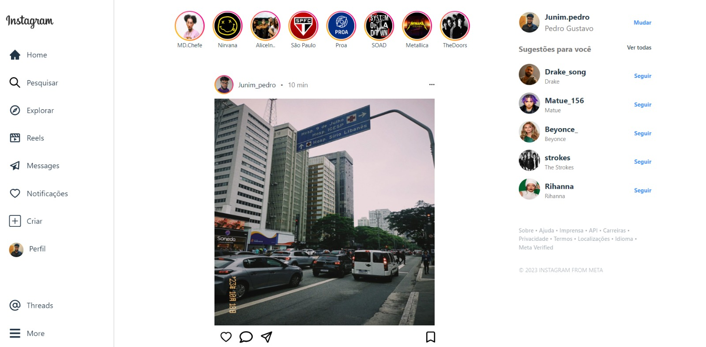

# Clone Instagram

A ideia deste projeto envolve a elaboração de uma réplica da página inicial do Instagram com o uso de React. Por meio dele, tive a oportunidade de investigar e compreender a manipulação de componentes, bem como aperfeiçoar a criação de um design distinto.

Acesse o link: https://clone-instagramnew.vercel.app/

## Tecnologias utilizadas
<ul>
  <li>HTML</li>
  <li>CSS</li>
  <li>JavaScript</li>
  <li>React + Vite</li>
</ul>
